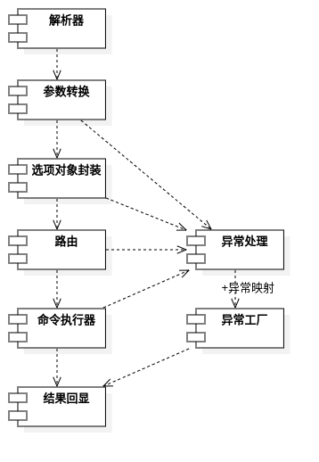

# mtool
> 节点管理工具可以帮助节点管理质押， 治理， 投票操作。
## 软件架构

- [命令操作手册](./docs/命令操作手册.txt)
- [新版本开发与发布流程](./docs/新版本开发与发布流程.md)


## 使用技术

- gradle
- jcommander
- junit
- mockito
- spring,springboot
- mybatis
- logback
- client-sdk(web3j)

## 项目结构

- mtool-client：客户端代码
- common：通用工具封装
- doc：文档说明


## 使用说明

## mtool-client（命令行工具）

#### mtool-client流程图



#### mtool-client编译运行
```bash
./gradlew :mtool-client:run --args="--help" // args填入命令行参数
```


## 打包
> 执行打包命令后会在`./build/distributions/`下生成mtool-client的发布包。
```bash
# 打包mtool-client
./gradlew clean distTar
```

> 把发布包解压后, 得到对应的 `bin/xxx` 可执行文件，就能使用对应程序

## 日志
> 默认日志运行级别为`INFO`，只打印跟mtool相关的日志，当需要充分了解sdk与节点的请求情况需要配置环境变量

```bash
# linux
JAVA_OPTS="-Dlog.level=debug" ./bin/mtool-client [options] [command] [command options]
# windows
set JAVA_OPTS="-Dlog.level=debug"
bin/mtool-client.bat [options] [command] [command options]
```

## 维护
### 检查可升级依赖包
```bash
./gradlew dependencyUpdates -Drevision=release
```

### 包安全检查
```bash
./gradlew dependencyCheckAnalyze
./gradlew dependencyCheckAggregate
```
